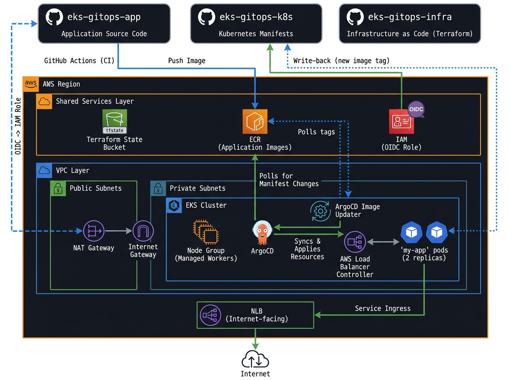
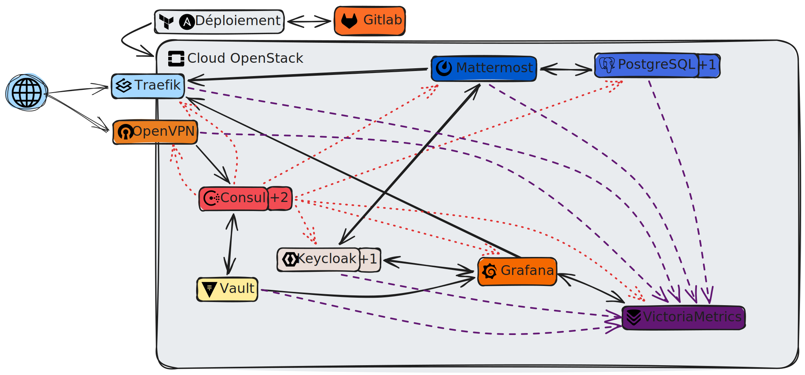
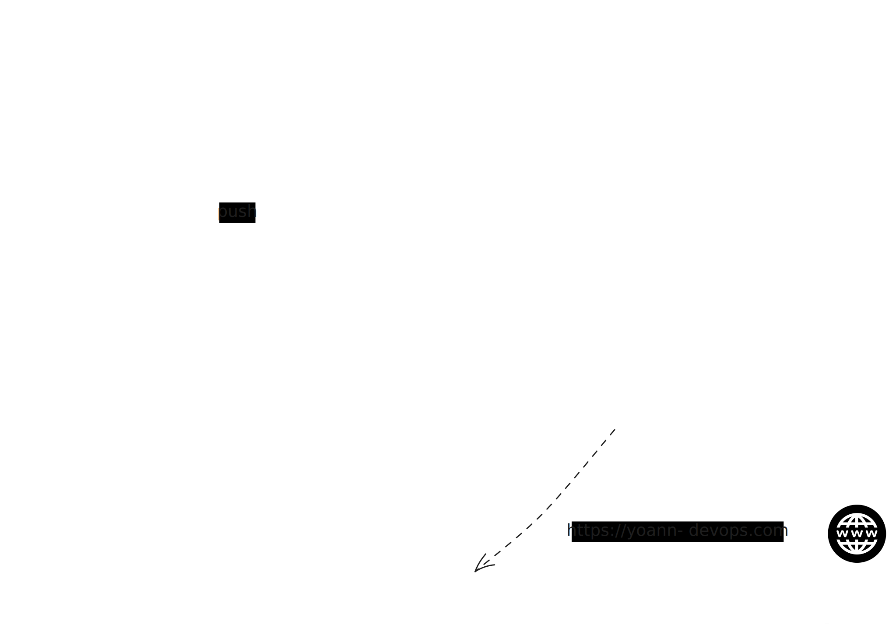
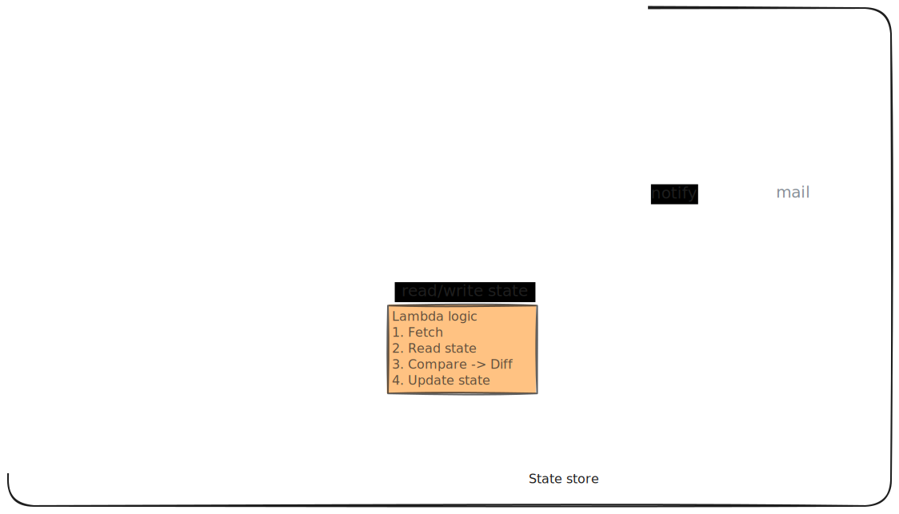

# 👋 Hi, I'm Yoann

  

  
  
  
  
  

---

## 🧠 About Me

Ingénieur système & réseau en transition vers le **DevOps & Cloud**, avec une forte culture de la **sécurité des infrastructures** et de l'**automatisation**. Mon objectif : décrocher mes premières missions en tant que **Freelance DevOps / Cloud Engineer**.

- 🖥️ Solide background **Windows Server, Linux (RHEL / Debian) & réseau** (Stormshield, Cisco, Fortinet)
- ⚙️ Automatisation d'infrastructures avec **Ansible**
- 🔐 Durcissement système selon les référentiels **CIS Benchmarks & ANSSI**
- ☁️ En transition active vers **AWS, Terraform & les pratiques DevOps** modernes
- 🎯 Objectif : acquérir mes premières missions freelance et évoluer vers **DevOps / Cloud Engineer**

---

## 🛠️ Tech Stack

### ☁️ Cloud & Infrastructure

  

### 💻 Système & Réseau

  

### ⚙️ DevOps & CI/CD

  

### 🔐 Sécurité

  
  
  
  

### 📊 Monitoring & Observabilité

  
  
  
  
  
  

---

## 🚀 Featured Projects

> ⚠️ GitHub me permet de mettre en avant mes projets terminés, tandis que mes projets en cours ou à diffusion restreinte sont sur mon 

### ☁️ IaC for a production-grade GitOps platform on AWS EKS &nbsp;
> Plateforme GitOps production-grade déployée sur Amazon EKS avec pipeline CI/CD entièrement automatisée
- Infrastructure provisionnée en IaC avec Terraform (VPC, EKS, ECR, IAM, S3 backend)
- Authentification GitHub Actions sans clé statique via OIDC — build et push ECR déclenchés à chaque push
- GitOps avec ArgoCD — déploiement automatique via Kustomize overlays (dev/prod)
- ArgoCD Image Updater détecte les nouveaux tags semver sur ECR et commit automatiquement dans le repo K8s
- Authentification IAM des pods via EKS Pod Identity (LBC, Image Updater)

  
  
  
  
  
  
  
  
  
  
  

### 🔒 Infra complète OpenStack
> Projet IaC en constante évolution visant à concevoir et automatiser une plateforme cloud complète sur le cloud public OpenStack d'Infomaniak.
- ☁️ Provisionnement Infrastructure as Code sur OpenStack avec Terraform et automatisation de la configuration via Ansible.
- 🔒 Sécurisation et gestion des accès avec OpenVPN, Vault, Traefik, Keycloak et gestion centralisée des secrets.
- 📊 Intégration d'une stack d'observabilité centralisée (monitoring, métriques, supervision).

  
  
  
  
  
  
  
  
  
  
  
  
  

### ☁️ Portfolio DevOps — Infrastructure & CI/CD AWS
> Site statique React/TypeScript déployé sur AWS via pipeline CI/CD entièrement automatisée
- Infrastructure provisionnée en IaC avec Terraform (S3, CloudFront, ACM, Route53, IAM OIDC)
- Authentification GitHub Actions sans clé statique via OIDC — build et déploiement déclenchés à chaque push 

  
  
  
  
  
  

### 🔔 E-commerce Brand Watcher &nbsp;
> Outil **serverless** de surveillance de catalogue e-commerce — détecte l'apparition de nouveaux articles sur une page cible et déclenche une notification email instantanée. Entièrement piloté par événements, zéro serveur à gérer.

 

  

  
  
  
  

---

## 📜 Certifications
 
| Badge | Certification
|:-----:|:-------------|
|  | AWS Solutions Architect – Associate |

---

  <i>💼 Disponible pour <b>missions freelance</b> — DevOps / Cloud Engineer</i> 

